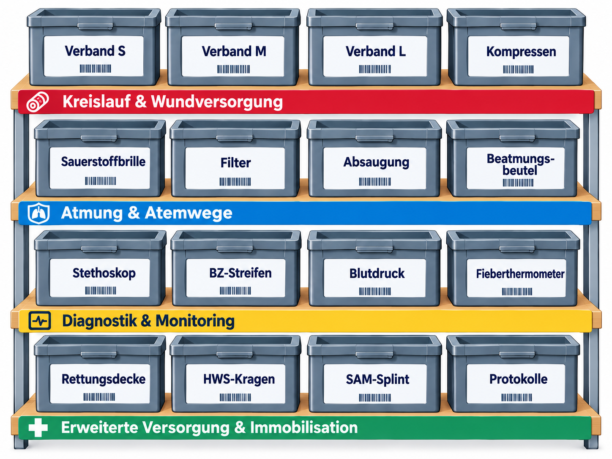
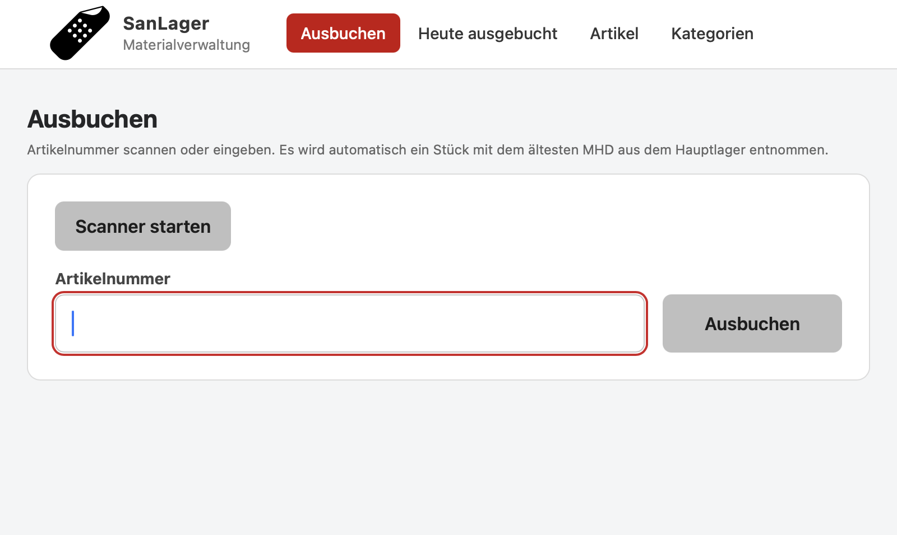
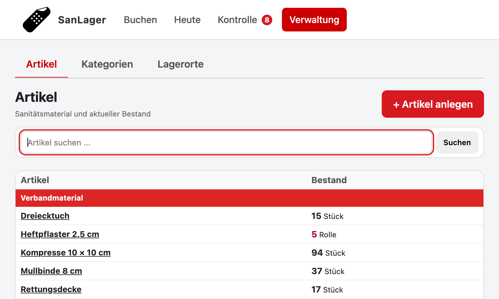
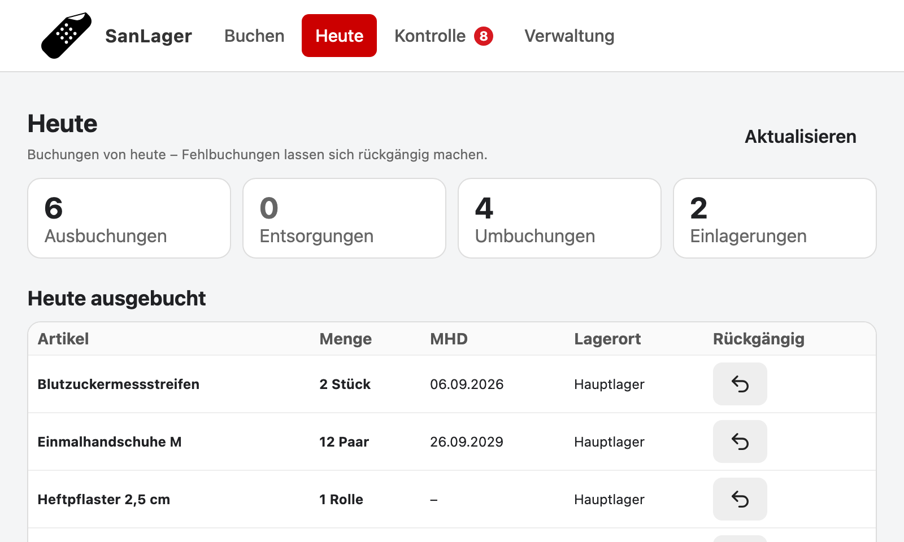
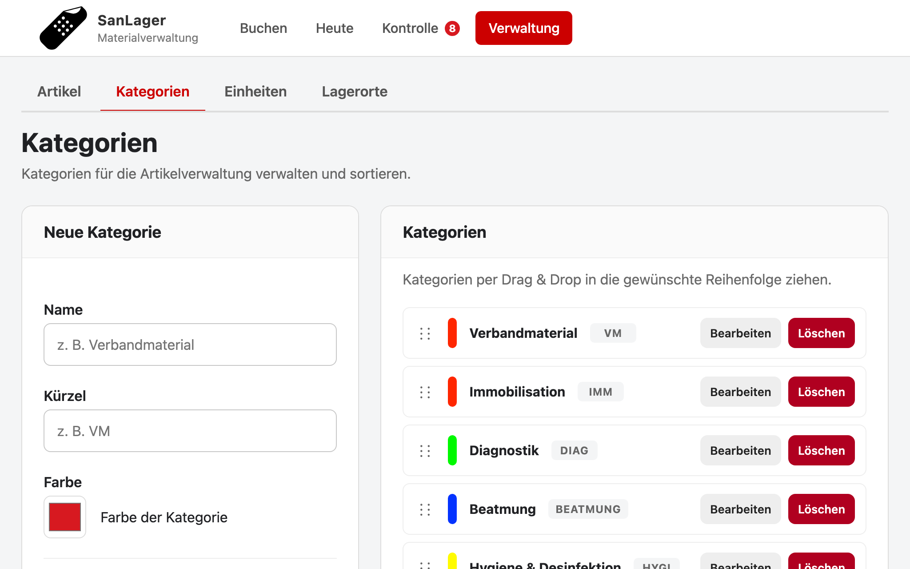

# SanLager

## Digitale Lagerverwaltung für Sanitätsmaterial

**SanLager** ist eine schlanke Webanwendung zur Verwaltung von Sanitätsmaterial.

Die Anwendung wurde speziell für den praktischen Einsatz im Sanitätslager entwickelt. Im Mittelpunkt stehen eine **einfache Bedienung**, eine **schnelle Bestandsübersicht** und die **Verwaltung von Mindesthaltbarkeitsdaten**.

Das System soll jederzeit einen schnellen Überblick über den aktuellen Bestand ermöglichen. Hierzu wird das Material in Kisten gelagert die entsprechent mit einem QR-Code-Etikett das in der App erzeugt werden kann beschriftet.


Es gibt eine an 800x480px angepasste Ansicht für den Raspberry Pi Touchscreen.

---

## Funktionen

* Übersicht des aktuellen Lagerbestands
* Verwaltung von Sanitätsmaterial
* Anzeige von Mindesthaltbarkeitsdaten
* Erkennung abgelaufener Artikel
* Verwaltung von Artikelstammdaten
* einfache und übersichtliche Bedienung
* optimiert für die Nutzung per Touchscreen
* lokale SQLite-Datenbank
* Webzugriff über Browser
* Raspberry-Pi-Terminal für das Lager (optional)

## ToDo

* Weekly Reportin:
** Benachrichtigung x Tage vor dem Ablauf von Material
** Benachrichtigung bei Unterschreiten der Mindestmengen
** Benachrichtigung bei Entnahme von Artikeln
* Unterstützung Labelprinter
* Test mit QR-Code-Scanner

---

## Screenshots
*Ausbuchen - auch via Kamera*


*Artikelübersicht*


*Heute ausgebuchte Artikel*


*Kategorien Anlegen/Sortieren/Anpassen*


---

## Aufbau

SanLager besteht aus einer webbasierten Anwendung und optional einem fest installierten Lagerterminal.

```text
┌──────────────────────────────┐
│          SanLager            │
│        Webanwendung          │
│                              │
│        PHP / SQLite          │
└──────────────┬───────────────┘
               │
               │ HTTPS
               │
┌──────────────▼───────────────┐
│       Raspberry Pi           │
│                              │
│       7" Touchscreen         │
│       Chromium Kiosk         │
│                              │
│      SanLager Terminal       │
└──────────────────────────────┘
```

---

## Dokumentation

Die technische Dokumentation ist in einzelne Bereiche aufgeteilt.

### 📖 Projekt

* Vorstellung und Konzept des SanLagers
* Aufbau und Funktionsweise
* verwendete Technologien

### 🗄️ Datenbank

➡️ **[Dokumentation der Datenbankstruktur und der einzelnen Tabellen.](docs/10-datenbank.md)**

### 🖥️ Raspberry Pi

Einrichtung des Raspberry Pi als festes SanLager-Terminal:

* Raspberry Pi OS
* Touchscreen
* Display-Drehung
* Chromium im Kiosk-Modus
* automatische Anmeldung
* Autostart
* Fehlerbehebung

➡️ **[Raspberry-Pi-Terminal einrichten](docs/99-raspberry-pi.md)**

### 🔧 Entwicklung

**[Dokumentation zur Projektstruktur, Entwicklung und Bereitstellung der Anwendung.](docs/11-entwicklung.md)**

---

## Technologie

SanLager verwendet bewusst einfache und robuste Technologien:

* **PHP**
* **SQLite**
* **HTML / CSS**
* **JavaScript**
* **Raspberry Pi OS**
* **Chromium**
* **Git / GitHub**

---

## Ziel

SanLager soll keine komplexe Warenwirtschaft sein.

Die Anwendung konzentriert sich auf das, was im Sanitätslager tatsächlich benötigt wird:

> **Was ist vorhanden, was läuft ab und was muss nachbeschafft werden?**

Die Bedienung soll dabei so einfach sein, dass sie auch direkt im Lager über einen Touchscreen genutzt werden kann.

---

## Status

SanLager befindet sich in der laufenden Entwicklung und wird schrittweise um weitere Funktionen ergänzt.

