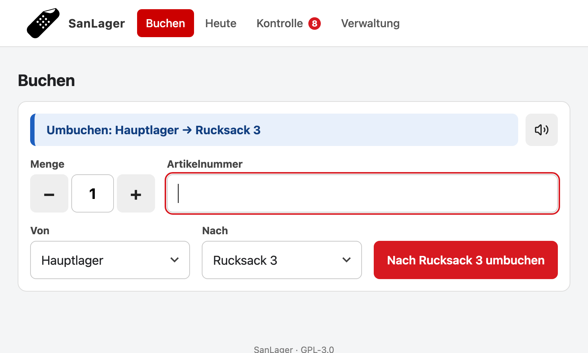
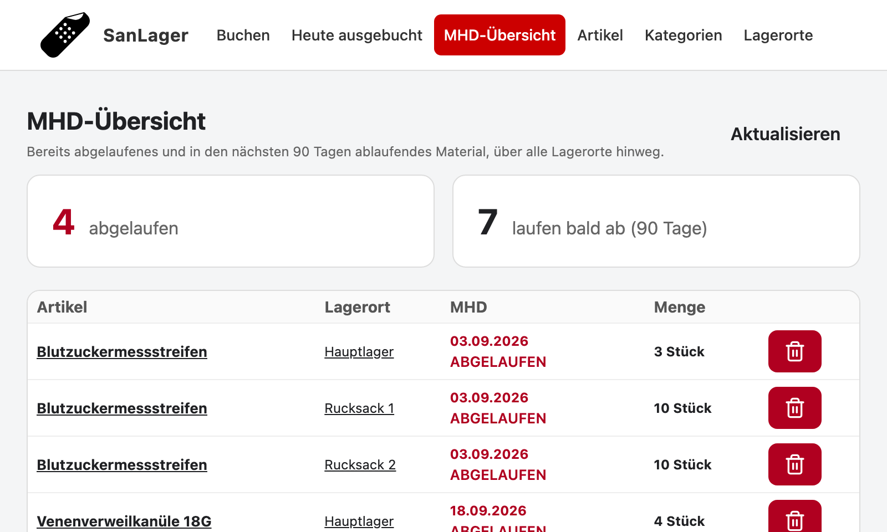
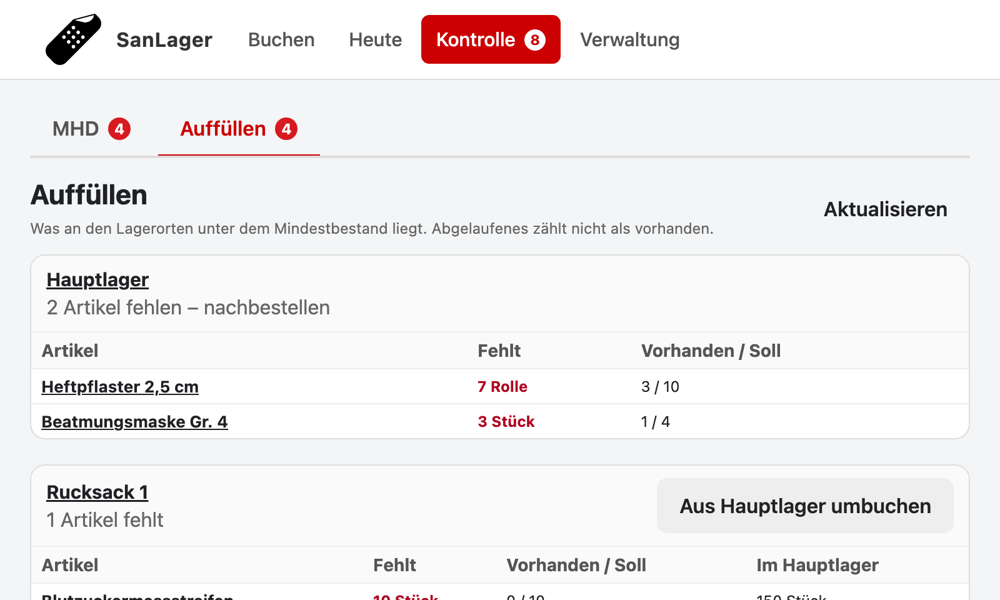
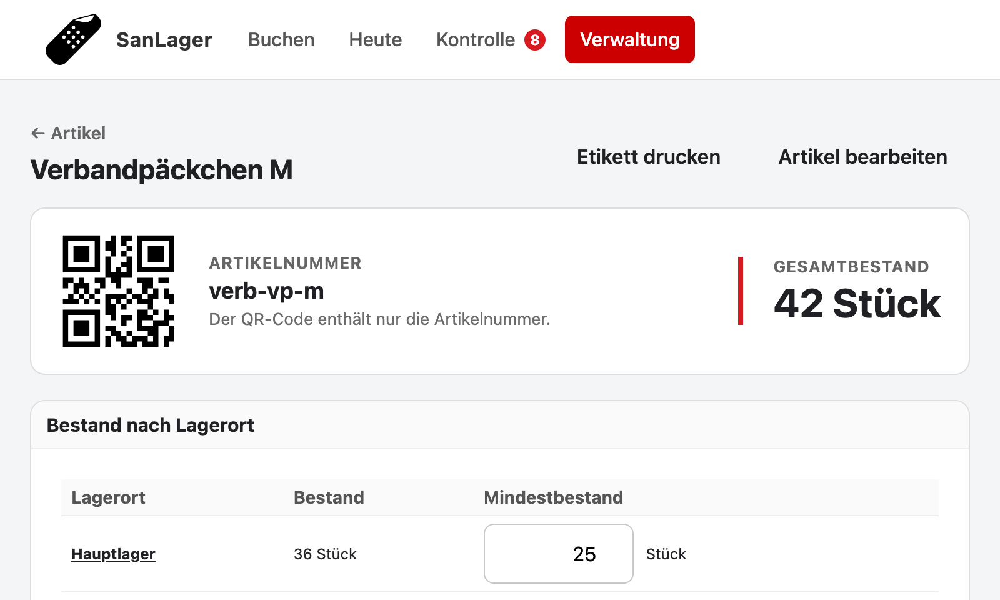
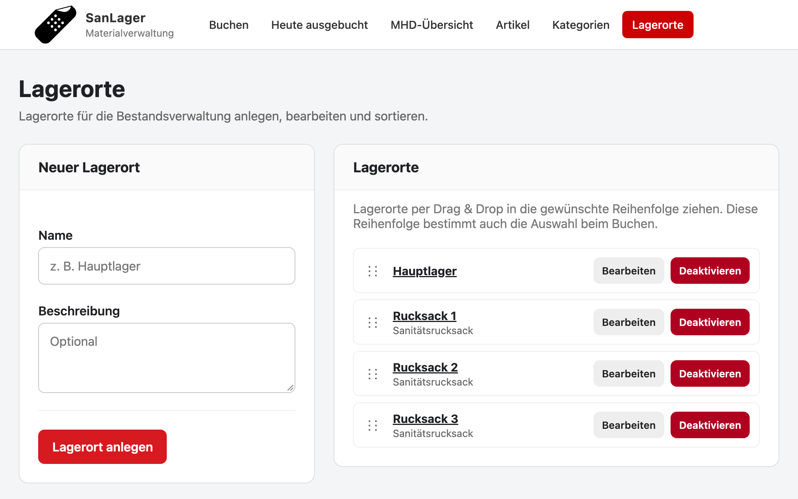
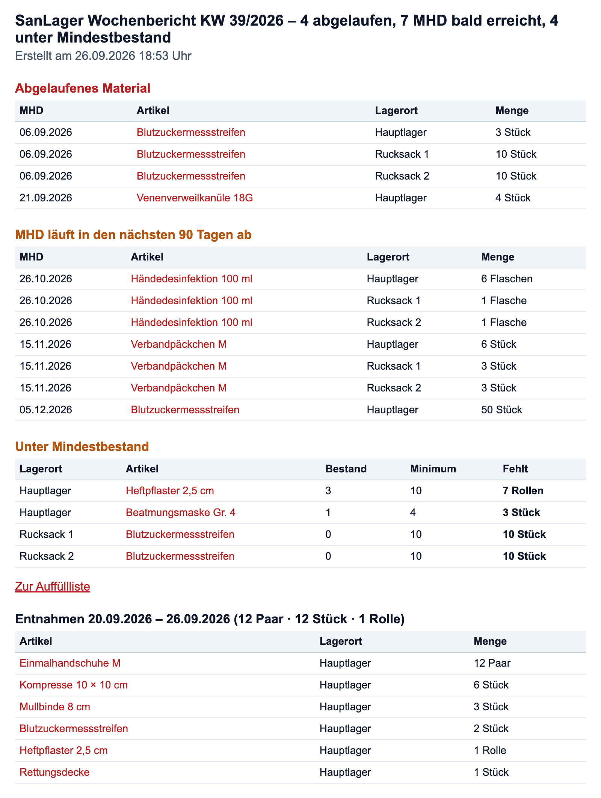

# SanLager

[](https://github.com/Offi83/sanlager/actions/workflows/tests.yml)

## Digitale Lagerverwaltung für Sanitätsmaterial

**SanLager** ist eine schlanke Webanwendung zur Verwaltung von Sanitätsmaterial, z. B. bei einer HiOrg.

Die Anwendung wurde speziell für den praktischen Einsatz im Sanitätslager entwickelt. Im Mittelpunkt stehen eine **einfache Bedienung**, eine **schnelle Bestandsübersicht** und die **Verwaltung von Mindesthaltbarkeitsdaten**.

Das System soll jederzeit einen schnellen Überblick über den aktuellen Bestand ermöglichen. Hierzu wird das Material in Kisten gelagert, die mit einem QR-Code-Etikett beschriftet sind. Das Etikett lässt sich in der App erzeugen.


Es gibt eine an 800×480 px angepasste Ansicht für den Raspberry-Pi-Touchscreen.

---

## Funktionen

**Buchen**
* Scannen per Kamera, Hand-Scanner oder Tastatur
* Ausbuchen oder Umbuchen in einen anderen Lagerort, dabei wird immer das älteste MHD zuerst genommen
* Einlagern per Scan mit MHD, das für die folgenden Scans stehen bleibt
* Menge vor dem Scan wählbar (z. B. 3 Packungen auf einmal), danach wieder 1
* Alarm, wenn dabei abgelaufene Ware gebucht wurde: „Aussortieren“ nimmt die Buchung zurück und entsorgt die ganze abgelaufene Charge am Lagerort
* Ton und Vibration (Android) als Rückmeldung beim Scannen, Ton je Gerät abschaltbar

**Heute**
* Alle Buchungen des Tages, Fehlbuchungen können rückgängig gemacht werden

**Kontrolle**
* Abgelaufenes und bald Ablaufendes, mit „Entsorgen“-Funktion
* Auffüllliste: was je Lagerort unter dem Mindestbestand liegt

**Verwaltung**
* Artikel mit Bestand, Mindestbestand, QR-Code und Etikettendruck
* Sammeletiketten: mehrere Artikel oder eine ganze Kategorie auf A4-Bögen (2 × 4), mit „alle 1ד je Kategorie oder für alle Artikel
* MHD je Artikel abschaltbar, z. B. für Mullbinden – dann entfallen die MHD-Felder
* Kategorien, Einheiten und Lagerorte anlegen und sortieren – Einheiten mit Einzahl und Mehrzahl („1 Rolle“, „5 Rollen“)
* Je Lagerort eine Packliste zum Ausdrucken (Soll, Ist je MHD, Kästchen zum Abhaken) und eine Inventur: gezählte Mengen eintragen, Abweichungen werden als Korrektur gebucht

**Außerdem**
* Wöchentlicher Bericht per E-Mail
* Touch-Bedienung, angepasst an das Raspberry-Pi-Display (800×480)
* Läuft ohne Internet, die Daten liegen in einer lokalen SQLite-Datenbank

## ToDo

* Unterstützung Labelprinter
* Test mit QR-Code-Scanner

---

## Screenshots

Die Screenshots zeigen Beispieldaten im Format des Raspberry-Pi-Displays (800×480). Sie werden mit `./script/screenshots.sh` erzeugt (siehe [Entwicklung](docs/11-entwicklung.md#screenshots-aktualisieren)).

*Buchen – hier eine Umbuchung vom Hauptlager in einen Rucksack. Auf Geräten mit Kamera erscheint zusätzlich „Scanner starten“.*


*Heute – alle Aus- und Umbuchungen und Entsorgungen des Tages*


*MHD-Übersicht – abgelaufenes und bald ablaufendes Material je Lagerort*


*Auffüllen – was je Lagerort unter dem Mindestbestand liegt und wie viel davon im Hauptlager vorhanden ist*


*Artikelübersicht – rot: unter Mindestbestand*


*Artikel mit QR-Code, Bestand und Mindestbestand je Lagerort*


*Kategorien anlegen, sortieren und anpassen*


*Lagerorte anlegen, sortieren und deaktivieren*


*Wochenbericht per E-Mail*


---

## Aufbau

SanLager besteht aus einer webbasierten Anwendung und optional einem fest installierten Lagerterminal.

```text
┌──────────────────────────────┐
│          SanLager            │
│        Webanwendung          │
│                              │
│        PHP / SQLite          │
└──────────────┬───────────────┘
               │
               │ HTTPS
               │
┌──────────────▼───────────────┐
│       Raspberry Pi           │
│                              │
│       7" Touchscreen         │
│       Chromium Kiosk         │
│                              │
│      SanLager Terminal       │
└──────────────────────────────┘
```

---

## Dokumentation

Die technische Dokumentation ist in einzelne Bereiche aufgeteilt.

### 📖 Projekt

Vorstellung, Funktionen und Aufbau stehen in diesem README: [Funktionen](#funktionen), [Aufbau](#aufbau), [Technologie](#technologie), [Ziel](#ziel).

### 🛠️ Installation

Voraussetzungen, Konfiguration, Webserver und Aktualisieren per `script/pull.sh`:

➡️ **[Installation](docs/05-installation.md)**

### 🗄️ Datenbank

➡️ **[Dokumentation der Datenbankstruktur und der einzelnen Tabellen.](docs/10-datenbank.md)**

### 🖥️ Raspberry Pi

Einrichtung des Raspberry Pi als festes SanLager-Terminal:

* Raspberry Pi OS
* Touchscreen
* Display-Drehung
* Chromium im Kiosk-Modus
* automatische Anmeldung
* Autostart
* Fehlerbehebung

➡️ **[Raspberry-Pi-Terminal einrichten](docs/90-raspberry-pi.md)**

### 📧 Wochenbericht

Einrichtung des wöchentlichen Berichts per E-Mail (SMTP-Zugang, Empfänger, Cron-Job):

➡️ **[Wochenbericht einrichten](docs/12-wochenbericht.md)**

### 💾 Datensicherung

Tägliche, geprüfte Sicherung der Datenbank per Cron, Aufbewahrung und Wiederherstellung:

➡️ **[Datensicherung einrichten](docs/13-datensicherung.md)**

### 🔧 Entwicklung

**[Dokumentation zur Projektstruktur, Entwicklung und Bereitstellung der Anwendung.](docs/11-entwicklung.md)**

---

## Technologie

SanLager verwendet bewusst einfache und robuste Technologien:

* **PHP**
* **SQLite**
* **HTML / CSS**
* **JavaScript**
* **Raspberry Pi OS**
* **Chromium**
* **Git / GitHub**

---

## Lizenz

SanLager ist freie Software unter der **GNU General Public License v3.0** (GPL-3.0-only), siehe [LICENSE](LICENSE).

Mitgelieferte und verwendete Fremdbestandteile (u. a. der QR-Code-Scanner html5-qrcode unter Apache-2.0 und Symbole aus Lucide unter ISC) sind mit ihren Lizenzen in [THIRD-PARTY-NOTICES.md](THIRD-PARTY-NOTICES.md) aufgeführt; die Lizenztexte liegen unter [licenses/](licenses/).

---

## Ziel

SanLager soll keine komplexe Warenwirtschaft sein.

Die Anwendung konzentriert sich auf das, was im Sanitätslager tatsächlich benötigt wird:

> **Was ist vorhanden, was läuft ab und was muss nachbeschafft werden?**

Die Bedienung soll dabei so einfach sein, dass sie auch direkt im Lager über einen Touchscreen genutzt werden kann.

---

## Status

SanLager befindet sich in der laufenden Entwicklung und wird schrittweise um weitere Funktionen ergänzt.

